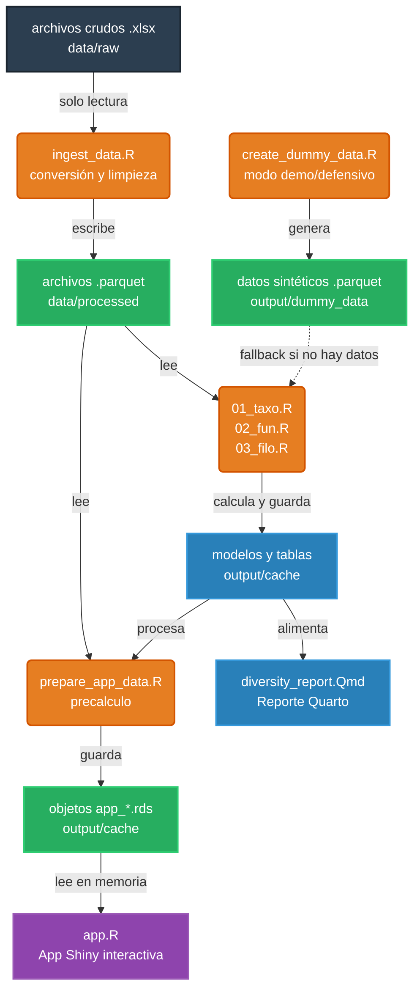

# Diversidad de arañas en el Parque Nacional del Teide (1995–2024)

Este repositorio contiene el código y los análisis para evaluar la diversidad taxonómica (TD), filogenética (PD) y funcional (FD) de las comunidades de arañas en el Parque Nacional del Teide, comparando los datos obtenidos en los muestreos de 1995 y 2024.

El proyecto se ha estructurado siguiendo buenas prácticas de MLOps orientadas a la reproducibilidad: los datos en crudo se tratan como inmutables (se convierten a formato Parquet), el código es modular, se integra un sistema continuo de ejecución (CI/CD) con un uso intensivo de cachés, y se incluye un visor interactivo desarrollado en Shiny.

## Estructura del proyecto

```text
TeideSpiders/
├── setup.R                          # Script de configuración inicial (mueve los datos a data/raw e inicializa renv)
├── config.R                         # Configuración global (rutas a los archivos, paleta de colores, semillas)
├── scripts/
│   ├── ingest_data.R                # Transforma los archivos crudos (.xlsx) a formato Parquet (para acelerar la lectura)
│   └── prepare_app_data.R           # Precalcula y guarda los objetos de datos que alimentan la app Shiny
├── R/
│   ├── data_prep.R                  # Funciones de limpieza y carga de datos
│   ├── model_utils.R                # Funciones para el modelado estadístico y la exportación de resultados
│   └── plot_utils.R                 # Funciones gráficas y estilos comunes
├── analysis/
│   ├── 01_taxo.R                    # Análisis de diversidad taxonómica
│   ├── 02_fun.R                     # Análisis de diversidad funcional
│   └── 03_filo.R                    # Análisis de diversidad filogenética
├── app/                             # Entorno aislado para la aplicación Shiny
│   ├── app.R                        # Dashboard interactivo (solo lectura)
│   ├── R/                           # Módulos de la app (Riqueza, NMDS, Métricas SES, Beta diversidad)
│   └── www/                         # Recursos estáticos (estilos CSS)
├── reports/
│   ├── _quarto.yml                  # Configuración del documento Quarto
│   └── diversity_report.Qmd         # Informe final que integra todos los resultados
├── data/                            # Carpeta local (no incluida en el control de versiones) para datos crudos y procesados
├── output/                          # Resultados generados (gráficos, tablas y caché de la app)
├── .github/workflows/               # Flujos de trabajo para GitHub Actions (CI/CD)
└── renv.lock                        # Archivo con las versiones exactas de las dependencias
```

## Flujo de información

La arquitectura del proyecto garantiza que los datos fluyan en un único sentido, desde su forma más cruda hasta los productos finales, manteniendo siempre una fuente de verdad única y reproducible:



## Modo Demo (Datos Sintéticos y Programación Defensiva)

Dado que los archivos crudos originales (`arañas.xlsx`) se han excluido del repositorio público por motivos de privacidad y peso, el pipeline incorpora un **sistema de carga defensiva**. 

Si las funciones de carga en `R/data_prep.R` no encuentran ni los archivos crudos ni sus derivados Parquet procesados, generarán un aviso de seguridad y cargarán automáticamente el conjunto de **datos sintéticos** (*dummy data*). Esto asegura que:
- La integración continua en **GitHub Actions** compile siempre con éxito.
- La **aplicación interactiva (Shiny)** pueda probarse inmediatamente sin depender de la base de datos real.

Para regenerar estos datos de prueba manualmente, ejecuta:
```R
source("data/create_dummy_data.R")
```

## Primeros pasos y reproducibilidad

1. **Clona el repositorio** y abre el proyecto en RStudio.
2. **Restaura el entorno de trabajo**:
   ```R
   renv::restore()
   ```
3. **Prepara los datos crudos**: Si tienes los archivos originales en formato `.xlsx` (`arañas.xlsx`, `matrizTraits.xlsx`, `zonas.xlsx`), cópialos a la carpeta `data/raw/` o ejecuta el script `setup.R` para automatizarlo.
4. **Convierte los datos a formato Parquet** (solo es necesario hacerlo una vez):
   ```R
   source("scripts/ingest_data.R")
   ```

## Análisis de datos y visor interactivo (Shiny)

El pipeline comprueba automáticamente la disponibilidad de datos en cada capa (Parquet real → Excel crudo → dummy data). Para ejecutar todo el flujo en orden:

```R
# 0. (Solo la primera vez, o si no hay datos reales) Generar datos sintéticos
source("data/create_dummy_data.R")

# 1. Ejecutar todos los análisis
source("config.R")
source("analysis/01_taxo.R")
source("analysis/02_fun.R")
source("analysis/03_filo.R")

# 2. Generar el informe estático con Quarto
quarto::quarto_render("reports/diversity_report.Qmd")

# 3. Preparar los datos para la app Shiny y lanzar el servidor local
source("scripts/prepare_app_data.R")
shiny::runApp("app")
```

## Integración continua (CI/CD)

El flujo configurado en GitHub Actions (`render-report.yml`) incorpora un sistema de cachés avanzado para `renv` (que evita tener que reinstalar los paquetes) y para los objetos analíticos. Cuando se suben cambios en el código o en los datos, GitHub Actions regenera automáticamente los archivos `.parquet` (o usa los sintéticos si procede), recalcula los índices de diversidad y compila el informe de Quarto, dejándolo disponible como un archivo descargable.

## Bugs corregidos durante la refactorización

Durante el proceso de refactorización se identificaron y corrigieron los siguientes errores presentes en los scripts originales:

| ID | Script | Descripción |
|----|--------|-------------|
| B1 | `03_filo.R` | `force.ultrametric()` recibía un vector de métodos en lugar de uno solo |
| B2 | `01_taxo.R` | Doble eliminación de columna en la construcción de la matriz de comunidad |
| B3 | Todos | `setwd()` dentro de los scripts rompía la portabilidad; sustituido por `here::here()` |
| B4 | Todos | Ausencia de `set.seed()` antes de cada permutación nula (ses.pd, ses.mpd…) |
| B5 | `02_fun.R` | `scale()` devuelve una matriz; faltaba `as.data.frame()` para preservar el tipo |
| B6 | `02_fun.R` | Dos llamadas a `hclust()` distintas producían árboles inconsistentes |
| B7 | `02_fun.R` | Correlación de Pearson aplicada a variables ordinales/binarias (reemplazada por Spearman) |
| B8 | Varios | `pivot_wider()` sin el argumento `id_cols` nombrado explícitamente |
| B9 | `03_filo.R` | `dendextend::as.dendrogram()` no existe; la función correcta es `stats::as.dendrogram()` |
| B10 | Varios | Mezcla de `xlsx` (requiere Java) y `openxlsx`; unificado en `openxlsx` |
| B11 | `model_utils.R` | `bind_cols()` ciego entre SES y zonas asumía filas paralelas; sustituido por `left_join()` explícito |

## Licencia

Este proyecto se distribuye bajo la Licencia MIT. Para más detalles, consulta el archivo `LICENSE`.
